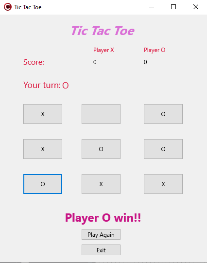

# cppTicTacToe
Tic Tac Toe developed in C++Builder / Jogo da Velha desenvolvido no C++Builder

## EN-US
Codes used in the Computer Graphics course taken at the University of Computer Science, with Professor Pedro Luiz UTFPR.

## PT-BR
Códigos utilizados na disciplina Computação Gráfica cursada na Universidade de Ciência da Computação, com Professor Pedro Luiz UTFPR.

## cppTicTacToe screenshot

